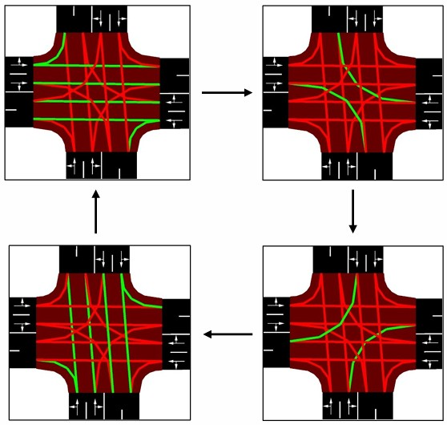
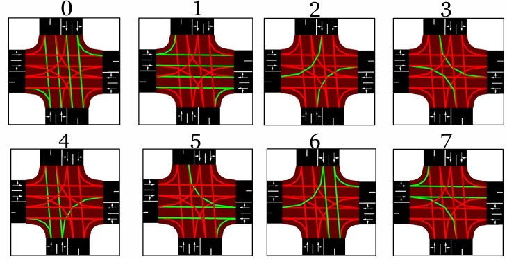
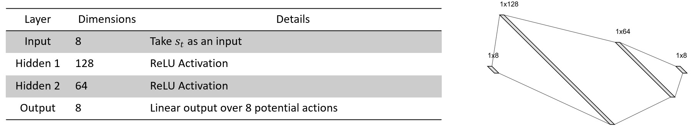
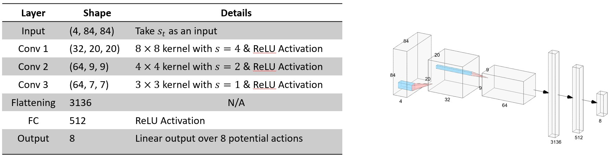
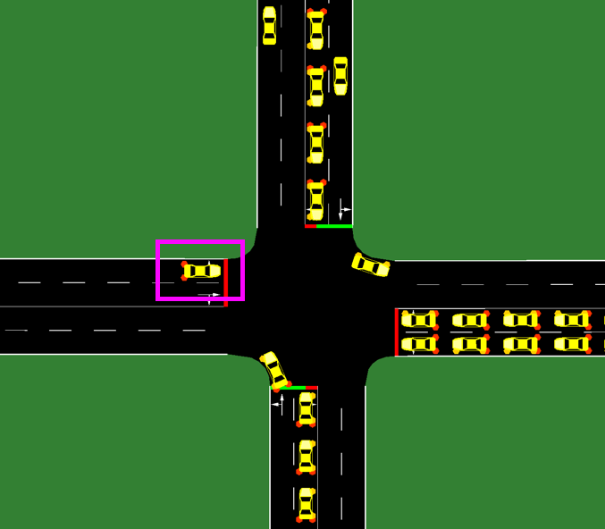
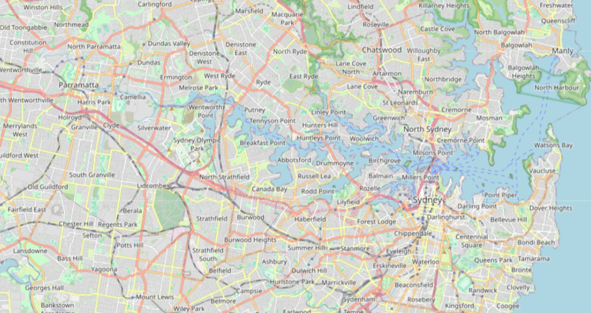
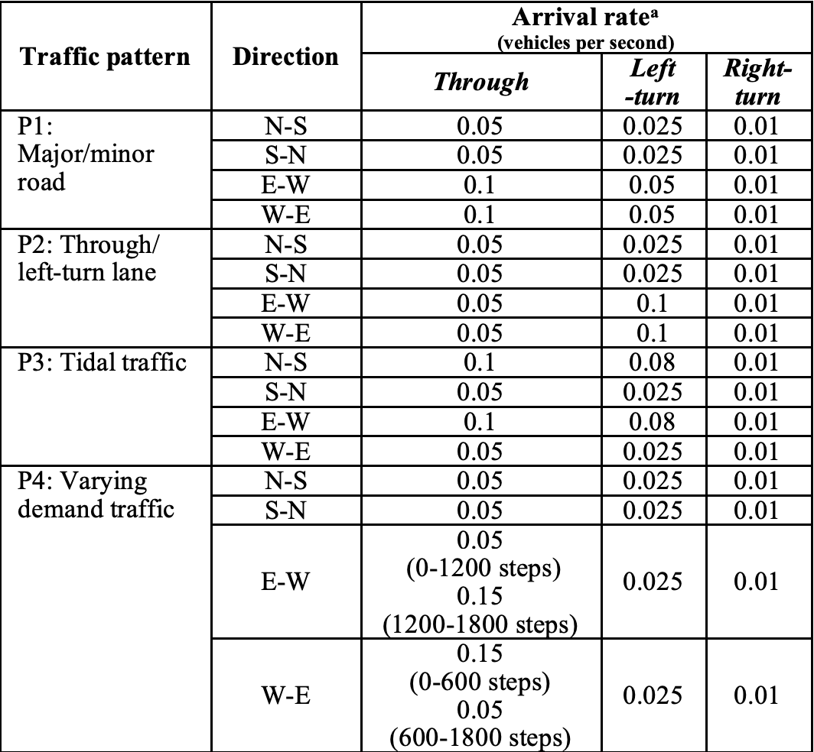
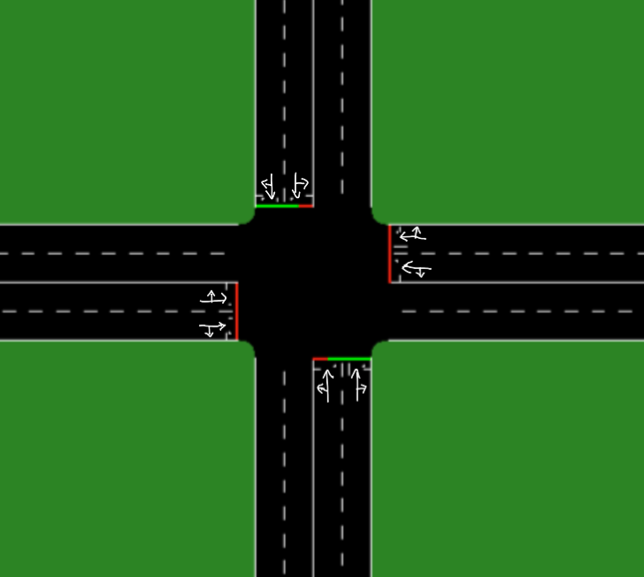
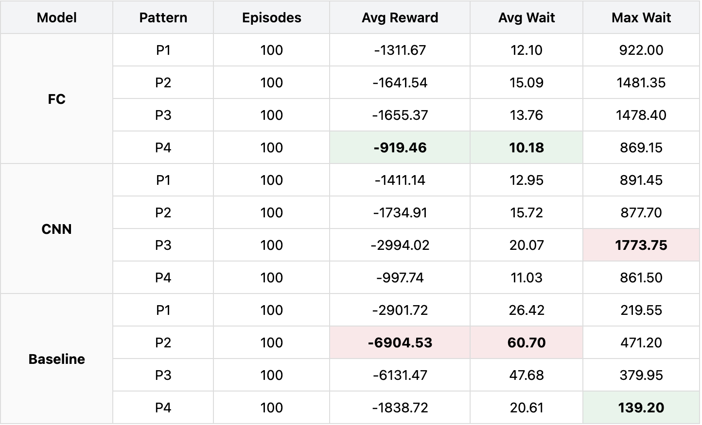

# 🚦 RL for Traffic Control — DREAM Project

> **Deep Reinforcement learning for Efficient Adaptive Management of traffic** (DREAM)  
> UNSW Sydney · COMP9444 Neural Networks and Deep Learning

A Deep Reinforcement Learning system that trains agents to adaptively control traffic light signals at a four-way urban intersection, dramatically outperforming fixed-time baselines and reducing average driver wait times by over 50%.

---

## 📑 Table of Contents

1. [Project Overview](#-project-overview)
2. [Problem Statement](#-problem-statement)
3. [Methodology](#-methodology)
   - [RL Formulation](#rl-formulation)
   - [State Space](#state-space)
   - [Action Space](#action-space)
   - [Reward Function](#reward-function)
4. [Model Architectures](#-model-architectures)
   - [Dense DQN](#1-dense-fully-connected-dqn)
   - [Convolutional DQN (CNN DQN)](#2-convolutional-dqn-cnn-dqn)
   - [Baseline: Fixed-Time Controller](#3-baseline-fixed-time-controller)
5. [Traffic Simulation Environment](#-traffic-simulation-environment)
   - [SUMO Simulator](#sumo-simulator)
   - [Traffic Patterns](#traffic-patterns)
6. [Hyperparameters](#-hyperparameters)
7. [Installation & Setup](#-installation--setup)
8. [Usage](#-usage)
   - [Training](#training)
   - [Evaluation](#evaluation)
   - [Visualization](#visualization)
9. [Results & Performance](#-results--performance)
10. [Key Findings & Discussion](#-key-findings--discussion)
11. [Limitations & Future Work](#-limitations--future-work)
12. [Repository Structure](#-repository-structure)
13. [References](#-references)
14. [Team](#-team)

---

## 🔍 Project Overview

Traffic congestion is a critical urban challenge. Sydney alone loses approximately **$6.1 billion annually** due to traffic congestion, contributing to lost productivity, increased greenhouse gas emissions, and poor driver quality of life. Traditional fixed-time traffic light systems cannot adapt to real-time traffic conditions, making them fundamentally inefficient.

This project, **DREAM**, develops and evaluates **Deep Q-Network (DQN)**-based reinforcement learning agents for adaptive traffic signal control at a four-way urban intersection. Two neural network architectures are compared:

| Agent | State Representation | Architecture |
|-------|---------------------|--------------|
| **Dense DQN** | 8D queue length vector | Fully-connected MLP |
| **CNN DQN** | 4 × 84 × 84 occupancy grids | Convolutional Neural Network |

Both agents are trained and evaluated using **SUMO (Simulation of Urban MObility)** across multiple real-world-inspired traffic patterns and benchmarked against a fixed-time baseline controller.

---

## 🚨 Problem Statement

Inefficient traffic light control using **fixed-time systems** causes:

- 🚗 Traffic congestion and longer travel times
- 💸 Lost economic productivity (~$6.1 billion/year in Sydney)
- 🌍 Increased greenhouse gas emissions
- 😤 Degraded driver quality of life

**Goal:** Train a reinforcement learning agent to learn optimal traffic light phase sequences based on real-time traffic conditions, minimizing queue lengths and wait times.

---

## 🧠 Methodology

### RL Formulation

The traffic signal control problem is modelled as a **Markov Decision Process (MDP)**:

| Component | Description |
|-----------|-------------|
| **Agent** | Traffic light controller |
| **Environment** | SUMO 4-way intersection simulation |
| **State (s)** | Traffic conditions at all lanes |
| **Action (a)** | Traffic light phase selection |
| **Reward (r)** | Negative sum of queue lengths across all lanes |

The agent uses the **Deep Q-Network (DQN)** algorithm (Mnih et al., 2015) to approximate the optimal action-value function:

```
Q*(s, a) = E[r + γ · max_{a'} Q*(s', a')]
```

---

### State Space

**Dense DQN — Queue Length Vector (8D):**

The state is an 8-dimensional vector of queue lengths (number of vehicles waiting at red lights) across all 8 lanes of the intersection:

```
s_t = [QL_1(t), QL_2(t), ..., QL_8(t)]
```

**CNN DQN — Occupancy Grid Stack (4 × 84 × 84):**

The state is a stack of 4 consecutive 84×84 binary occupancy grids, where each cell is 1 if a vehicle occupies that position and 0 otherwise. Stacking 4 frames captures temporal dynamics:

```
s_t = [G_{t-3}, G_{t-2}, G_{t-1}, G_t]  where G_k ∈ {0,1}^{84×84}
```

This representation is inspired by the Atari DQN paper and captures both spatial and temporal vehicle dynamics.

---

### Action Space

8 possible traffic light phase configurations corresponding to non-conflicting vehicle movement groups (straight + right-turn combinations from each direction):

| Action ID | Description |
|-----------|-------------|
| 0 | Northbound through + Southbound through (green) |
| 1 | Northbound left-turn + Southbound left-turn (green) |
| 2 | Eastbound through + Westbound through (green) |
| 3 | Eastbound left-turn + Westbound left-turn (green) |
| 4–7 | Additional phase configurations |

Actions are implemented as `phase = 2 × action_id` (even IDs = green phases; odd IDs = yellow transition phases managed automatically).

The action diagrams are shown below:

| Phase 0 | Phase 1 | Phase 2 | Phase 3 |
|---------|---------|---------|---------|
|  |  |  |  |

---

### Reward Function

The reward at each timestep is the **negative total queue length** across all 8 lanes:

```
r_t(a_t) = -∑_{i=1}^{8} QL_i(t)
```

This formulation:
- ✅ Is directly observable from the simulation
- ✅ Penalises congestion in all lanes equally
- ✅ Equivalent to minimising QL_t (since QL_{t-1} is constant at decision time)
- ✅ Simplifies the approach from Guo et al. (2019) while achieving similar goals

The agent learns to **maximise cumulative discounted reward**, which is equivalent to **minimising total queue lengths** over time.

---

## 🏗️ Model Architectures

### 1. Dense (Fully-Connected) DQN

**Input:** 8-dimensional queue length vector  
**Output:** 8 Q-values (one per action)

```
Input Layer:  8 neurons (queue lengths)
              ↓
Hidden Layer: Linear(8 → 128) + ReLU
              ↓
Hidden Layer: Linear(128 → 64) + ReLU
              ↓
Output Layer: Linear(64 → 8)  [8 Q-values]
              ↓
Action:       argmax over Q-values
```

**Strengths:**
- ✅ Simple and interpretable — direct queue length to action mapping
- ✅ Fast convergence (~25 episodes)
- ✅ Consistently best performance across all traffic patterns
- ✅ Stable training curve

**Saved Model:** `policy_fc_nn.pt`

---

### 2. Convolutional DQN (CNN DQN)

**Input:** 4 × 84 × 84 stacked occupancy grids  
**Output:** 8 Q-values (one per action)

Architecture inspired by the Atari DQN paper (Mnih et al., 2015):

```
Input: (4 × 84 × 84)
  ↓
Conv2d(in=4,  out=32, kernel=8×8, stride=4) + ReLU  → (32 × 19 × 19)
  ↓
Conv2d(in=32, out=64, kernel=4×4, stride=2) + ReLU  → (64 × 8 × 8)
  ↓
Conv2d(in=64, out=64, kernel=3×3, stride=1) + ReLU  → (64 × 6 × 6)
  ↓
Flatten: 2304 neurons
  ↓
Linear(2304 → 512) + ReLU
  ↓
Linear(512 → 8)    [8 Q-values]
  ↓
argmax → Best Action
```

**Strengths:**
- ✅ Captures spatial and temporal traffic dynamics
- ✅ Richer state representation beyond queue lengths
- ✅ Best maximum wait time reduction

**Limitations:**
- ❌ Slower convergence (~50 episodes)
- ❌ Training instability, especially on pattern P3
- ❌ Computationally intensive (~12 hours training vs ~4 hours for Dense DQN)

**Saved Model:** `policy_cnn_nn.pt`

---

### 3. Baseline: Fixed-Time Controller

A non-adaptive, deterministic traffic light controller that mimics real-world NSW fixed-time traffic management:

- **4 fixed phases** cycling in a predetermined order
- **6-second green** + **4-second yellow** per phase (10 seconds per phase, 40 second cycle)
- No learning; identical behaviour regardless of traffic conditions

| Advantage | Disadvantage |
|-----------|-------------|
| ✅ Predictable and prevents worst-case scenarios | ❌ Cannot adapt to traffic changes |
| ✅ Easy to deploy in real-world systems | ❌ Significantly worse average performance |
| ✅ No training required | ❌ Ignores real-time traffic conditions |

---

## 🌐 Traffic Simulation Environment

### SUMO Simulator

The project uses **SUMO (Simulation of Urban MObility)**, an open-source microscopic traffic simulation suite, controlled via the **TraCI (Traffic Control Interface)** Python API.

**Intersection Setup:**
- 4-way urban intersection
- 2 lanes per approach direction (through-lane + turning lane)
- **Total:** 8 lanes
- **Simulation step:** 0.05 seconds (fine-grained control)
- **Vehicle arrival:** Poisson-distributed for stochastic, realistic traffic

**Environment Functions:**

| Function | Description |
|----------|-------------|
| `sumo_config(pattern, seed)` | Build SUMO command-line arguments |
| `reset_env(pattern)` | Create new SUMO simulation for a traffic pattern |
| `change_env()` | Cycle to the next traffic pattern |
| `get_queue_length()` | Get 8D queue length vector from all lanes |
| `generate_occupancy_grid()` | Create 84×84 binary occupancy grid for CNN |
| `step(action)` | Execute action step for Dense DQN |
| `step_cnn(action)` | Execute action step for CNN DQN |

---

### Traffic Patterns

Four distinct traffic patterns are used for training and evaluation, simulating different real-world scenarios:

| Pattern | Description | Characteristics |
|---------|-------------|-----------------|
| **P1** | Major/minor road asymmetry | Significantly more traffic on one road direction |
| **P2** | Lane-type differentiation | Through-lane vs. left-turn lane distinction |
| **P3** | Tidal traffic flow | Time-varying directional dominance (rush hour) |
| **P4** | Balanced traffic | Symmetric flow across all directions |

**Training Strategy:** The agent is trained on patterns P1, P2, and P3 simultaneously (cycling between patterns each episode) to learn a generalised policy. P4 is used for out-of-distribution evaluation.

The intersection layout and traffic patterns are illustrated below:



---

## ⚙️ Hyperparameters

### Dense DQN — Optimal Configuration

| Hyperparameter | Value | Description |
|----------------|-------|-------------|
| `gamma` | 0.99 | Discount factor for future rewards |
| `epsilon` | 0.9 | Initial exploration rate (ε-greedy) |
| `epsilon_decay` | 0.95 | Multiplicative decay per episode |
| `min_epsilon` | 0.05 | Minimum exploration floor |
| `learning_rate` | 0.01 | Adam optimizer learning rate |
| `batch_size` | 128 | Experience replay mini-batch size |
| `target_update_freq` | 1800 | Steps between target network updates |
| `memory_size` | 20,000 | Experience replay buffer capacity |

### CNN DQN — Optimal Configuration

| Hyperparameter | Value | Description |
|----------------|-------|-------------|
| `gamma` | 0.999 | Higher discount factor (more future-focused) |
| `epsilon` | 0.9 | Initial exploration rate |
| `epsilon_decay` | 0.95 | Multiplicative decay per episode |
| `min_epsilon` | 0.05 | Minimum exploration floor |
| `learning_rate` | 0.01 | Adam optimizer learning rate |
| `batch_size` | 128 | Experience replay mini-batch size |
| `target_update_freq` | 1800 | Steps between target network updates |
| `memory_size` | 20,000 | Experience replay buffer capacity |

### Tuned Parameter Ranges

| Parameter | Values Tested | Best Value (Dense) | Best Value (CNN) |
|-----------|--------------|-------------------|-----------------|
| `gamma` | 0.99, 0.995, 0.999 | 0.99 | 0.999 |
| `epsilon_decay` | 0.95, 0.97, 0.99 | 0.95 | 0.95 |
| `memory_size` | 10,000, 20,000 | 20,000 | 20,000 |

**DQN Key Components:**
- **Experience Replay:** Randomly samples past `(s, a, r, s')` transitions to break temporal correlation
- **Target Network:** A separate, periodically-updated copy of the policy network to stabilise Q-targets
- **ε-Greedy Exploration:** Starts at high exploration (ε=0.9) and decays to near-pure exploitation (ε=0.05)

---

## 🛠️ Installation & Setup

### Prerequisites

1. **Python 3.8+**
2. **SUMO Traffic Simulator** — [Installation Guide](https://sumo.dlr.de/docs/Installing/)
3. **Set SUMO_HOME environment variable:**
   ```bash
   export SUMO_HOME=/path/to/sumo
   # Or on Windows:
   set SUMO_HOME=C:\path\to\sumo
   ```

### Install Python Dependencies

```bash
pip install torch torchvision
pip install traci sumolib
pip install jupyter notebook
pip install matplotlib pandas seaborn
```

Or install all at once:

```bash
pip install torch torchvision traci sumolib jupyter notebook matplotlib pandas seaborn
```

### Verify SUMO Installation

```bash
sumo --version
python -c "import traci; print('TraCI OK')"
```

### Clone & Open Repository

```bash
git clone https://github.com/dhwanu19/rl-for-traffic-control.git
cd rl-for-traffic-control
jupyter notebook submission_nb.ipynb
```

---

## 🚀 Usage

All code is contained in the single Jupyter notebook `submission_nb.ipynb`. Run cells in order.

### Training

**Train Dense DQN:**
```python
# Define optimal hyperparameters
params_fc = {
    "gamma": 0.99,
    "epsilon": 0.9,
    "epsilon_decay": 0.95,
    "min_epsilon": 0.05,
    "learning_rate": 0.01,
    "batch_size": 128,
    "target_update_freq": 1800,
    "memory_size": 20000
}

# Train for 200 episodes on patterns P1, P2, P3
results_fc = train_agent(
    params=params_fc,
    model_class=DQN_FC,
    get_state_fn=get_current_state,
    step_fn=step,
    episodes=200
)

# Save trained weights
torch.save(results_fc["trained_model"].state_dict(), "policy_fc_nn.pt")
```

**Train CNN DQN:**
```python
params_cnn = {
    "gamma": 0.999,
    "epsilon": 0.9,
    "epsilon_decay": 0.95,
    "min_epsilon": 0.05,
    "learning_rate": 0.01,
    "batch_size": 128,
    "target_update_freq": 1800,
    "memory_size": 20000
}

results_cnn = train_agent(
    params=params_cnn,
    model_class=DQN_CNN,
    get_state_fn=get_current_state_cnn,
    step_fn=step_cnn,
    episodes=200
)

torch.save(results_cnn["trained_model"].state_dict(), "policy_cnn_nn.pt")
```

**`train_agent()` returns a dictionary:**
```python
{
    "trained_model":       <PyTorch policy network>,
    "rewards_per_episode": [...],       # Total reward per episode
    "avg_wait_per_ep":     [...],       # Average wait time per episode (seconds)
    "max_wait_per_ep":     [...],       # Max wait time per episode (seconds)
    "pattern_rewards":     {...},       # Per-pattern breakdown
    "pattern_avg_waits":   {...},
    "pattern_max_waits":   {...},
    "avg_reward_last_N":   float,       # Mean over last N episodes
    "avg_wait_last_N":     float,
    "max_wait_last_N":     float
}
```

---

### Evaluation

**Evaluate Dense DQN on a specific traffic pattern:**
```python
# Evaluate on 100 episodes of pattern P1
results = evaluate_fc_model_on_pattern(
    pattern="P1",
    model_path="policy_fc_nn.pt",
    episodes=100
)
print(f"Avg Reward:    {np.mean(results['pattern_rewards']):.2f}")
print(f"Avg Wait Time: {np.mean(results['pattern_avg_waits']):.2f} seconds")
print(f"Max Wait Time: {np.mean(results['pattern_max_waits']):.2f} seconds")
```

**Evaluate CNN DQN:**
```python
results_cnn = evaluate_cnn_model_on_pattern(
    pattern="P2",
    model_path="policy_cnn_nn.pt",
    episodes=100
)
```

**Evaluate Fixed-Time Baseline:**
```python
baseline_results = get_baseline_results(pattern="P1", episodes=100)
```

---

### Visualization

Training curves and evaluation comparisons are generated automatically within the notebook:

- **Learning Curves:** Rewards per episode during training, broken down by traffic pattern
- **Wait Time Curves:** Average and maximum wait times over training
- **Comparison Boxplots:** Side-by-side distributions of Dense DQN vs CNN DQN vs Baseline for each metric and pattern

Example training reward curves:



Example evaluation results:



---

## 📊 Results & Performance

Models were evaluated on **100 episodes per traffic pattern** after training for 200 episodes.

### Overall Performance Comparison

| Metric | Dense DQN | CNN DQN | Baseline |
|--------|:---------:|:-------:|:--------:|
| **Avg Reward** ↑ | **-1330.55** | -1558.28 | -5312.30 |
| **Avg Wait Time (s)** ↓ | **12.62** | 14.42 | ~45.00 |
| **Max Wait Time (s)** ↓ | 601.10 | **588.60** | ~300.00 |

> **Note:** Reward units are cars in queue (more negative = more queued cars). Wait times in seconds.

### Performance by Traffic Pattern

| Pattern | Metric | Dense DQN | CNN DQN | Baseline |
|---------|--------|:---------:|:-------:|:--------:|
| **P1** | Avg Reward | ~-1000 | ~-1200 | -2901.72 |
| **P1** | Avg Wait | ~10 sec | ~12 sec | ~26 sec |
| **P2** | Avg Reward | ~-1400 | ~-1600 | -6904.53 |
| **P2** | Avg Wait | ~13 sec | ~15 sec | ~61 sec |
| **P3** | Avg Reward | ~-1600 | ~-1900 | -6131.47 |
| **P3** | Avg Wait | ~15 sec | ~17 sec | ~55 sec |

### Key Performance Improvements Over Baseline

- 🟢 Dense DQN reduces average wait time by **~72%** compared to the baseline
- 🟢 CNN DQN reduces average wait time by **~68%** compared to the baseline
- 🟢 Dense DQN improves average reward by **~75%** over the baseline (P1–P3)
- 🟡 Both RL agents show higher **maximum** wait times (~600s) than the baseline (~300s), since the reward function has no fairness constraint — the baseline's cycling schedule guarantees each lane is served within each 40-second cycle, preventing worst-case starvation

Evaluation comparison plots:





---

## 💡 Key Findings & Discussion

### 1. Dense DQN Outperforms CNN DQN

Despite CNN's richer state representation, the simpler Dense DQN consistently achieves:
- Lower average reward (less congestion)
- Lower average and maximum wait times
- Faster and more stable convergence (~25 vs ~50 episodes)

**Reason:** Queue length is a sufficiently expressive state for this problem. The 8D queue vector directly encodes the information needed to make good phase decisions, while occupancy grids add noise and computational complexity without providing actionable additional information.

### 2. Both RL Agents Vastly Outperform Fixed-Time Baseline

All RL agents achieve 60–75% better average rewards than the fixed-time controller across all patterns. This validates the core thesis that adaptive RL-based control is substantially superior to fixed-time approaches.

### 3. Training Convergence

- **Dense DQN:** Converges in ~25 episodes, remaining stable for the rest of training
- **CNN DQN:** Takes ~50 episodes to converge, with periodic spikes especially on pattern P3
- **Baseline:** No training required; deterministic performance

### 4. Generalisation Across Traffic Patterns

Training on P1, P2, and P3 simultaneously produces an agent that generalises effectively:
- The agent learns a single policy capable of handling multiple traffic distributions
- Performance degrades gracefully even on unseen pattern P4

### 5. Fairness vs. Throughput Trade-off

Both RL agents occasionally allow individual lanes to experience very long wait times (>600 seconds). This is because the reward function optimises global queue minimisation without fairness constraints, allowing the agent to starve low-demand lanes.

---

## 🔮 Limitations & Future Work

### Current Limitations

| Limitation | Description |
|------------|-------------|
| **CNN Instability** | Exhibits high variance in Q-value estimates and struggles with rare state-action combinations, especially under tidal traffic pattern P3 |
| **Lane Starvation** | Reward function has no fairness term; rare lanes can be severely delayed |
| **Single Intersection** | Model trained and evaluated on one intersection type only |
| **Fixed Simulation** | SUMO parameters (speed limits, lane geometry) are fixed |
| **No Pedestrians** | Simulation does not include pedestrian crossing phases |

### Proposed Improvements

1. **Improve CNN Architecture:**
   - Add additional convolutional layers
   - Adjust filter sizes and strides for intersection-scale grids
   - Increase replay buffer size for better coverage of state space

2. **Incorporate Fairness into Reward:**
   - Add per-lane maximum wait time penalty term
   - Prevent lane starvation while maintaining throughput

3. **Multi-Intersection Extension:**
   - Extend to coordinated multi-agent control across an intersection network
   - Apply graph neural networks to model intersection topology

4. **Real-World Validation:**
   - Test policies on real traffic control hardware
   - Validate with real-world traffic count data
   - Compare against commercial adaptive systems (SCATS, SCOOT)

5. **Advanced RL Algorithms:**
   - Explore Dueling DQN and Double DQN for more stable training
   - Test Proximal Policy Optimisation (PPO) and Soft Actor-Critic (SAC)
   - Try multi-step returns to reduce variance

---

## 📁 Repository Structure

```
rl-for-traffic-control/
├── submission_nb.ipynb              # Main Jupyter notebook (all code)
│   ├── Cells 1–12                  #   Setup, imports, SUMO config, DQN architectures
│   ├── Cells 13–18                 #   Hyperparameter tuning results
│   ├── Cells 19–26                 #   Training (Dense DQN, CNN DQN, Baseline)
│   └── Cells 27–37                 #   Evaluation, comparison plots
│
├── COMP9444_Project_Report_DREAM.pdf   # Full technical project report
├── COMP9444_Presentation_DREAM.pptx   # Project presentation slides
│
├── method_img1.jpg                  # Traffic phase diagram — Phase 0
├── method_img2.jpg                  # Traffic phase diagram — Phase 1
├── method_img3.jpg                  # Traffic phase diagram — Phase 2
├── method_img4.jpg                  # Traffic phase diagram — Phase 3
├── image_1.png                      # Intersection layout diagram
├── image_2.png                      # Training reward curves
├── image_5.png                      # Evaluation performance summary
├── image_7.png                      # Wait time comparison plot
├── image_8.png                      # Reward distribution comparison
│
└── README.md                        # This file
```

**Generated during training (not committed):**
```
policy_fc_nn.pt                      # Trained Dense DQN weights
policy_cnn_nn.pt                     # Trained CNN DQN weights
```

---

## 📚 References

1. **Mnih, V. et al. (2015).** Human-level control through deep reinforcement learning. *Nature, 518*, 529–533. [[Paper]](https://www.nature.com/articles/nature14236)
   > Foundation of the DQN algorithm used in this project (experience replay, target network, ε-greedy exploration).

2. **Guo, Y. et al. (2019).** A reinforcement learning approach for intelligent traffic signal control at urban intersections. *IEEE Intelligent Transportation Systems Conference (ITSC)*. [[Paper]](https://ieeexplore.ieee.org/document/8917268)
   > Defines the traffic phase and state representations used in this project.

3. **Lopez, P.A. et al. (2018).** Microscopic Traffic Simulation using SUMO. *IEEE Intelligent Transportation Systems Conference (ITSC)*. [[Paper]](https://ieeexplore.ieee.org/document/8569938)
   > SUMO simulator documentation and API reference.

4. **Sutton, R.S. & Barto, A.G. (2018).** Reinforcement Learning: An Introduction (2nd ed.). MIT Press. [[Book]](http://incompleteideas.net/book/the-book-2nd.html)
   > Foundational RL theory including MDPs, Q-learning, and value function approximation.

---
